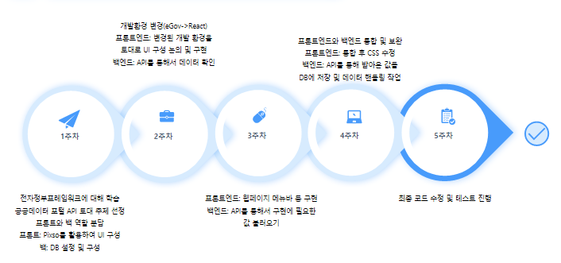
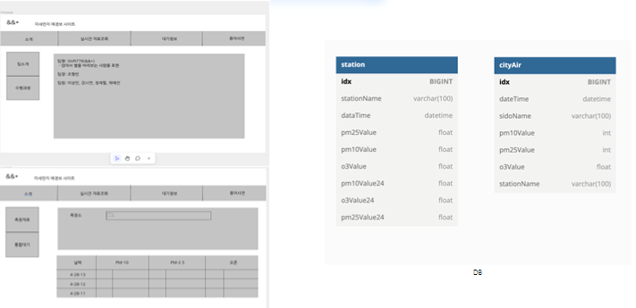
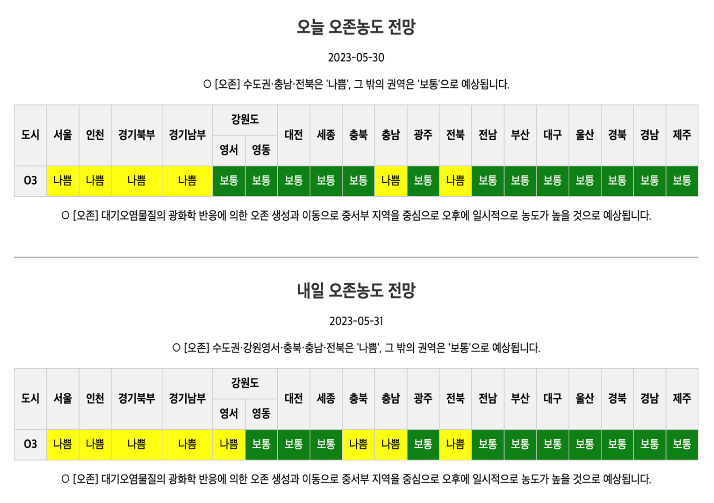
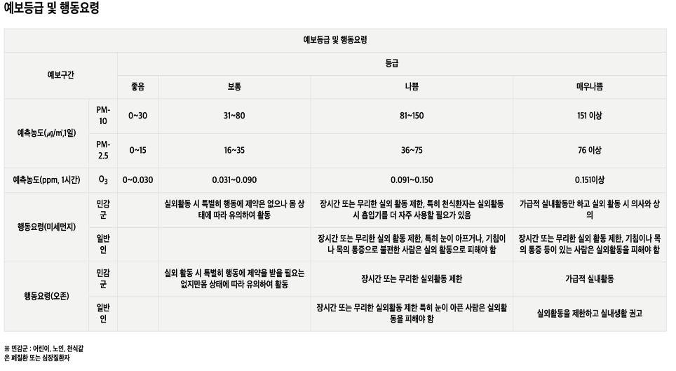
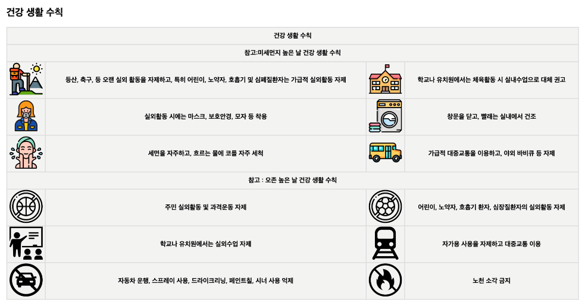
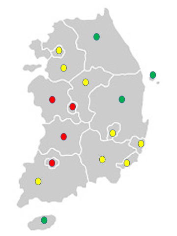
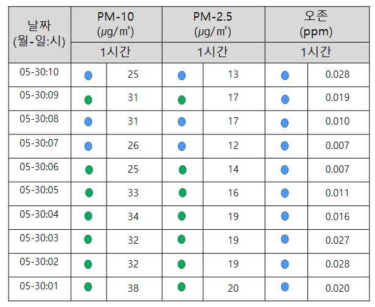
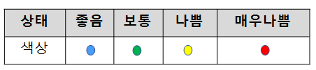
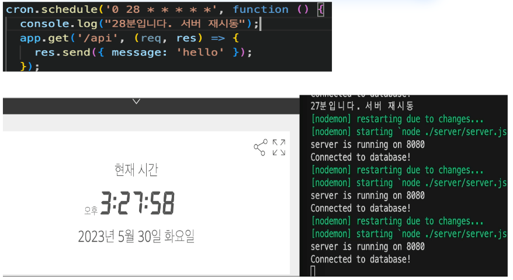

# 🌫️ AIR DCU
**👥 시프트778 (&&*)**
> **미세먼지 예·경보 및 대기오염 정보 제공 웹사이트**  
> 본 프로젝트는 **에어코리아**의 공공 API를 사용하여 데이터를 실시간으로 불러옵니다.  
🔗 [에어코리아 공식 웹사이트](https://www.airkorea.or.kr/)

## 📝 소개
**AIR DCU**는 미세먼지와 오존에 대한 사회적 관심이 높아진 현재,  
사용자들에게 실시간 대기오염 정보를 제공하고 건강한 일상생활을 돕기 위해 제작된 웹사이트

주요 기능은 다음과 같습니다:

- 실시간 대기오염 정보 확인 (측정소 기반 검색)
- 미세먼지 예보 및 경보 정보 확인
- 시도별 공기질 데이터 조회
- 대기질 상태에 따른 행동 요령 및 생활 수칙 안내

## 💻 기술 스택

| 구성 | 기술 |
|------|------|
| Frontend |  |
| Backend |   |
| Tools |   |

## 개발 일정

## 개발 계획

## 기능 소개

- 측정소명을 기준으로 대기 상태를 조회하고, 결과는 그래프로 시각화합니다.

---
- 미세먼지(PM10), 초미세먼지(PM2.5)는 24시간 평균, 오존(O₃)은 1시간 평균 기준으로 조회

---
- 시도별 미세먼지(PM10), 초미세먼지(PM2.5), 오존(O₃) 정보를 표로 제공하며, 일평균, 최고값, 최저값 표시

---
- 대기질 예/경보를 나타내는 지도

---
- 시도별 미세먼지(PM10), 초미세먼지(PM2.5), 오존(O₃)의 오늘과 내일 예보를 표 형태로 제공
- 예보 등급에 따라 좋음(파랑), 보통(초록), 나쁨(빨강) 등의 색상으로 시각화

---
- ‘알림마당’ 섹션을 통해 예보 등급에 따른 행동요령과 건강 생활 수칙을 안내
- 사용자들이 대기질 상태에 맞게 스스로를 보호할 수 있도록 정보를 제공

## 보완할 점
- 전국 측정소 데이터를 기반으로, 한반도 전체의 대기질 정보를 지도 위에 시각화하여 제공
- 사용자는 지도를 통해 지역별 미세먼지 현황을 한눈에 확인할 수 있어 정보 전달력이 향상

---
- 지역대기오염 정보를 4개 등급과 색상으로 나누어 사용자가 한 눈에 대기오염 정도를 보기 편하도록 표현

---
- 설정한 시간에 맞춰 API 데이터를 자동으로 DB에 저장하는 스케줄러 기능이 미구현 상태
- 예보 시간별 요청 파라미터와 데이터 형식 변화에 따른 예외처리도 함께 보완
